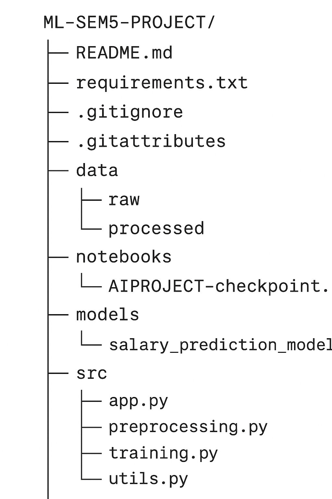
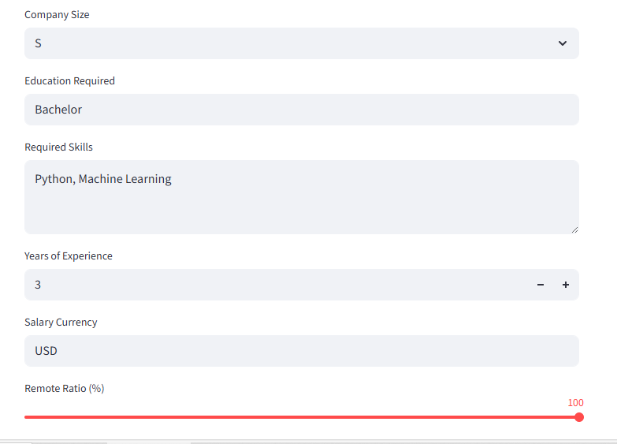

# 🧠 AI Job Salary Prediction

Predict salaries for AI / Tech jobs based on job details such as title, experience level, company size, remote ratio, skills, and more.

---

## 📑 Table of Contents
- [Overview](#overview)
- [Features](#features)
- [Project Structure](#project-structure)
- [Installation](#installation)
- [Usage](#usage)
- [Model & Data](#model--data)
- [Results](#results)
- [Screenshots](#screenshots)
- [Future Work](#future-work)
- [License](#license)

---

## Overview
This project uses **Machine Learning** (Scikit-Learn) to estimate job salaries.  
A simple **Streamlit** web app allows users to input job details and instantly view predicted salaries (USD & INR).

---

## Features
- Clean **data preprocessing**: encoding, scaling, feature selection.
- **Machine Learning model** trained on historical job salary data.
- **Interactive Streamlit UI** for live predictions.
- Visualizations & feature importance for insights.
- Easy deployment (local or cloud).

---

## Project Structure

Model & Data

Algorithm(s): Linear Regression, Random Forest (final model tuned & saved with Joblib)

Input Features: job title, experience, company size, industry, skills, remote ratio, etc.

Target: salary in USD

Results

R² Score: 0.96 (test set)

RMSE: 11,000 USD

Predictions shown in both USD and INR.

Screenshots
Web App	Salary Prediction
## Screenshots  
Web App – Salary Prediction  

	
Future Work

Model improvements (try XGBoost, deep learning).

Cloud deployment (Streamlit Cloud, AWS, etc.).

Add more granular skill embeddings & market trends.

License

MIT License © 2025 [ANSHJAISWAR]

